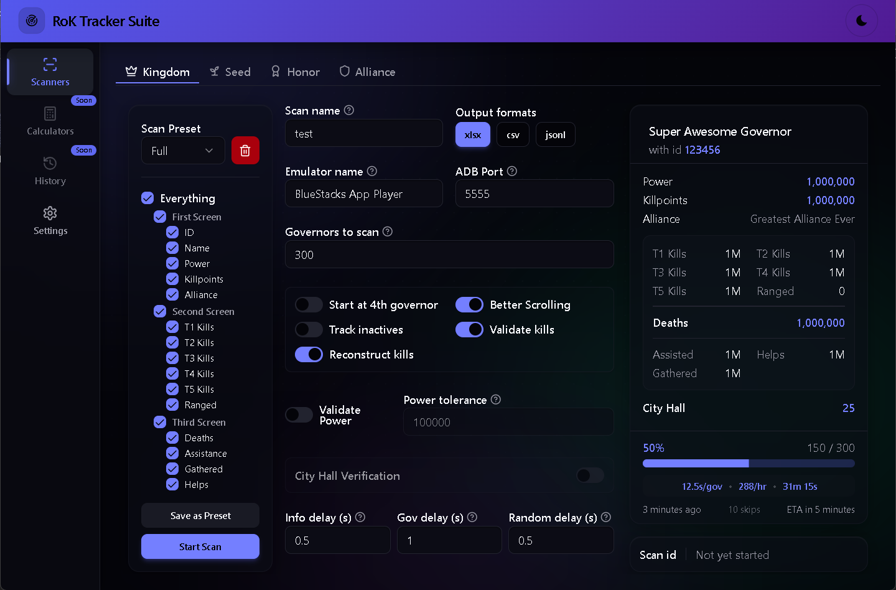
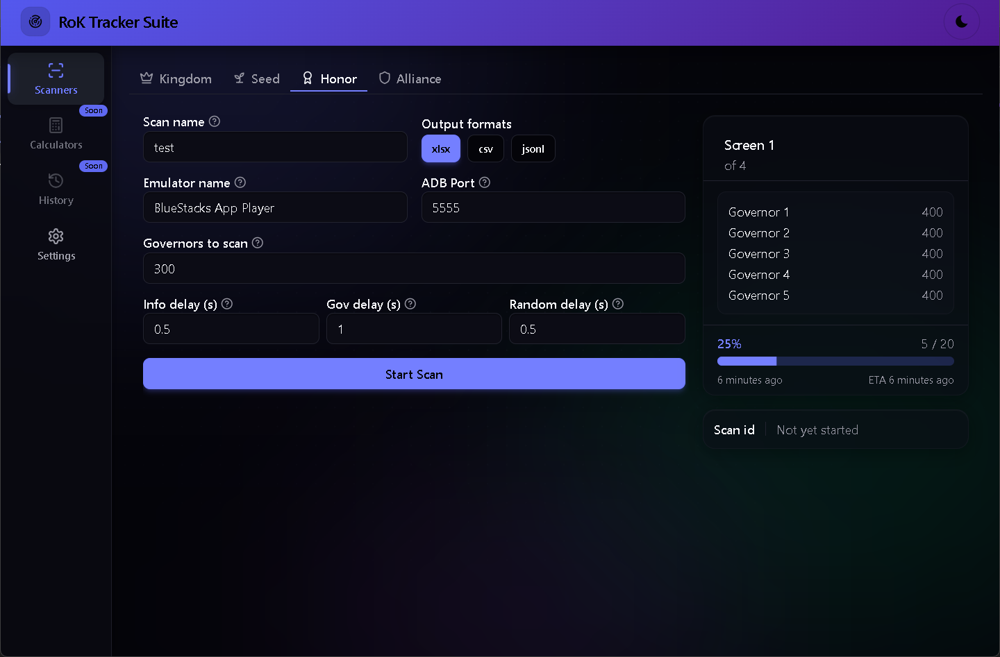
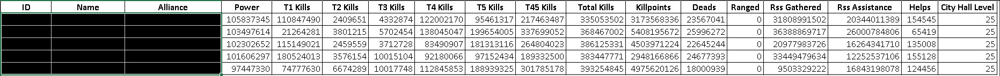

# RokTracker

[](LICENSE)
[](https://www.python.org/)
[](https://tauri.app/)
[](#requirements)

**Open-source Rise of Kingdoms stats management tool.** Automatically scan and track the top players in your kingdom, alliance, and honor leaderboards using OCR and ADB.

Originally based on the tool by [nikolakis1919](https://github.com/nikolakis1919/RokTracker) and [Cyrexxis](https://github.com/Cyrexxis/RokTracker), this version features a modern Tauri v2 desktop app with a Vue 3 + shadcn-vue interface, a Nuitka-compiled Python backend, and automatic updates — all bundled into a single Windows installer.

---

## Table of Contents

- [App Preview](#app-preview)
- [What's in this Version](#whats-in-this-version)
- [Features](#features)
- [Requirements](#requirements)
- [Installation](#installation)
  - [Simple Installation (Installer)](#simple-installation-installer)
  - [Development & Architecture](#development--architecture)
- [Usage](#usage)
- [Configuration](#configuration)
- [Emulator Setup](#emulator-setup)
  - [Bluestacks 5](#bluestacks-5)
  - [LD Player (Experimental)](#ld-player-experimental)
- [Output Formats](#output-formats)
- [Important Notes](#important-notes)
- [Troubleshooting & Support](#troubleshooting--support)
- [Contributing](#contributing)
- [License](#license)

---

## App Preview

### Kingdom Scanner

The main scanner — configure presets, fine-tune timings, and track every governor stat in real time.

<p align="center">
  
</p>

### Alliance Scanner &nbsp;&nbsp;|&nbsp;&nbsp; Honor Scanner &nbsp;&nbsp;|&nbsp;&nbsp; Seed Scanner

<p align="center">
  
  &nbsp;&nbsp;
  
  &nbsp;&nbsp;
  
</p>

---

## What's in this Version

- **Tauri v2 desktop app** — replaced PyWebView + Bottle with a native Tauri shell for faster startup and smaller bundle
- **Modern UI** — rebuilt with Vue 3, shadcn-vue, and Tailwind CSS (dark theme, responsive layout)
- **Nuitka sidecar** — Python backend compiled with Nuitka (~99 MB, down from ~258 MB with PyInstaller)
- **Unified installer** — single `.exe` installer, no Python required for end users
- **All 4 scanners** — Kingdom, Alliance, Honor, and Seed in one application
- **Auto-updates** — the app automatically checks for new versions and can update itself in-place

> **Note:** v1 config is not compatible with other versions. Launch the app and verify your settings on the **Settings** page.

---

## Features

### Kingdom Scanner

- Complete kingdom ranking scan with detailed governor data
- Captures: Governor ID, Name, Power, Kill Points, Ranged Points, T1–T5 Kills, Total Kills, T4+T5 Kills, Dead Troops, RSS Gathered, RSS Assistance, Helps, and Alliance Name
- **Kill validation** — detects incorrect kills based on kill-to-killpoint ratios; saves flagged images to `manual_review/` (prefix `F`) with log warnings
- **Kill reconstruction** — optionally attempts to recover incorrect kill data; saves images to `manual_review/` (prefix `R`) with log info
- **Inactive detection** — automatically skips inactive accounts; optionally saves screenshots to `inactives/`
- **Power validation** — optional plausibility check for governor power
- **Resume scan** — continue a scan from where you left off
- **Configurable scan presets** — choose exactly which data fields to capture

### Alliance Scanner

- Complete alliance ranking scan
- Saves governor name and score with screenshot backup

### Honor Scanner

- Complete personal honor ranking scan
- Same output format and image backup as the alliance scanner

### Seed Scanner

- Lightweight scanner for quickly capturing only kill points or power from kingdom rankings
- Works like the alliance scanner but targets kingdom-level data

### General

- **OCR engine** — Tesseract with configurable page segmentation and engine modes
- **Multiple output formats** — XLSX, CSV, and JSONL
- **Modern GUI** — built with Vue 3, shadcn-vue, and Tailwind CSS
- **Emulator support** — Bluestacks 5 (recommended) and LD Player (experimental)
- **Configurable timings** — fine-tune delays for different system speeds
- **Automatic updates** — get notified of new versions and update with one click, no manual downloads needed

---

## Requirements

| Requirement            | Details                                                                                                                   |
| ---------------------- | ------------------------------------------------------------------------------------------------------------------------- |
| **OS**                 | Windows 10 or 11 (64-bit)                                                                                                 |
| **Emulator**           | [Bluestacks 5](https://www.bluestacks.com/bluestacks-5.html) (recommended) or LD Player                                   |
| **Tesseract Data**     | [Trained models](https://github.com/tesseract-ocr/tessdata) — place in `deps/tessdata/`                                   |
| **ADB Platform Tools** | [Download](https://dl.google.com/android/repository/platform-tools_r31.0.3-windows.zip) — place in `deps/platform-tools/` |

> For building from source, you also need: [Python 3.13+](https://www.python.org/downloads/), [Node.js 18+](https://nodejs.org/), [Rust](https://rustup.rs/), and [pnpm](https://pnpm.io/).

---

## Installation

### Simple Installation (Installer)

No Python, Node.js, or Rust required — just install and run.

1. **Download** the latest release: **[Latest Release](https://github.com/Nexor256/RoK-Tracker/releases/latest)**
   - Choose `RoK-Tracker-Suite-setup.exe` (NSIS)
2. **Run the installer** — follow the setup wizard
3. **Launch the app once** — it will auto-create the `deps/` folder structure
4. **Add dependencies** to the `deps/` folder (located next to the installed app):
   - Download [ADB Platform Tools](https://dl.google.com/android/repository/platform-tools_r31.0.3-windows.zip) → extract contents into `deps/platform-tools/`
   - Download [Tesseract trained data](https://github.com/tesseract-ocr/tessdata) (`eng.traineddata` at minimum) → place in `deps/tessdata/`
5. **Configure your emulator** ([see Emulator Setup](#emulator-setup))
6. **Relaunch** the app — you're ready to scan!

> **Tip:** Future updates are automatic! The app will notify you when a new version is available and can update itself with one click — no need to redownload.

> [!WARNING]
> **Windows Defender False Positive:** The installer bundles a custom Python executable (`scanner_sidecar.exe`) that handles the scanning engine. Because it is heavily compressed and compiled into a single file with Nuitka, **Windows Defender and other antiviruses often falsely flag it as malware** and may silently quarantine it upon installation. If the app gets stuck on the "Initializing Sidecar" loading screen, please check your **Windows Security -> Protection History**, click on the blocked threat, select **Restore / Allow on device**, and restart the app.

**Folder structure after first launch:**

```
RoK Tracker Suite/                        (install directory)
├── RoK Tracker Suite.exe                 ← Launch this
├── scanner_sidecar.exe                   ← Python backend (runs automatically)
├── config.json                           ← App configuration
└── deps/                                 ← Auto-created on first launch
    ├── inputs/                           ← Input templates (bundled)
    ├── tessdata/                         ← Add OCR data here
    │   └── eng.traineddata              ← You download this
    └── platform-tools/                   ← Add ADB here
        └── adb.exe                      ← You download this
```

### Development & Architecture

```text
┌─────────────────────────────────────┐
│           Tauri v2 Shell            │
│  ┌───────────────────────────────┐  │
│  │   Vue 3 + shadcn-vue Frontend │  │
│  │   (HTML/CSS/JS in WebView)    │  │
│  └──────────────┬────────────────┘  │
│                 │ invoke / listen   │
│  ┌──────────────▼────────────────┐  │
│  │   Rust Backend (commands.rs)  │  │
│  │   Sidecar Manager (sidecar.rs)│  │
│  └──────────────┬────────────────┘  │
│                 │ stdin/stdout JSON │
│  ┌──────────────▼────────────────┐  │
│  │   Python Sidecar (Nuitka exe) │  │
│  │   scanner_sidecar.py          │  │
│  │   └── roktracker/ (scanners)  │  │
│  └───────────────────────────────┘  │
└─────────────────────────────────────┘
```

| Component          | Technology                         | Purpose                                 |
| ------------------ | ---------------------------------- | --------------------------------------- |
| **Desktop shell**  | Tauri v2 (Rust)                    | Native window, IPC, bundling            |
| **Frontend**       | Vue 3, shadcn-vue, Tailwind CSS    | UI (pages, components, styling)         |
| **Backend bridge** | Rust (`commands.rs`, `sidecar.rs`) | Routes commands to Python sidecar       |
| **Scanner engine** | Python (Nuitka-compiled)           | OCR, ADB, data processing               |
| **Auto-updater**   | Tauri Updater Plugin               | Checks GitHub Releases for new versions |

> **Developers:** To build the standalone installer from source, please see the **[Building from Source](https://github.com/Nexor256/RoK-Tracker/wiki/Building-from-Source)** wiki page for full setup instructions.

---

## Usage

**From installer:** Launch "RoK Tracker Suite" from the Start Menu or desktop shortcut.

**From source (development):**

```bash
npx --prefix gui_frontend tauri dev
```

The app opens a native window where you can:

1. Select which scanner to run (Kingdom, Alliance, Honor, or Seed)
2. Configure scan settings and presets on the **Settings** page
3. Monitor scan progress in real time
4. View the last scanned governor data

Scan results are saved to the corresponding output folder:

| Scanner  | Output folder     |
| -------- | ----------------- |
| Kingdom  | `scans_kingdom/`  |
| Alliance | `scans_alliance/` |
| Honor    | `scans_honor/`    |
| Seed     | `scans_seed/`     |

<p align="center">
  
</p>

---

## Configuration

All settings can be configured from the **Settings** page inside the application. There is no need to manually edit `config.json`.

Available settings include:

| Category     | Settings                                                                                                                                                 |
| ------------ | -------------------------------------------------------------------------------------------------------------------------------------------------------- |
| **Scan**     | Kingdom name, number of governors, resume, scroll mode, inactive tracking, power/kill validation, kill reconstruction, output formats (XLSX, CSV, JSONL) |
| **OCR**      | Page segmentation mode, OCR engine mode, languages                                                                                                       |
| **Emulator** | Emulator type (Bluestacks or LD Player), instance name, config file path, ADB port                                                                       |

---

## Emulator Setup

Regardless of which emulator you use, the following display settings are **required**:

| Setting        | Value        |
| -------------- | ------------ |
| **Resolution** | 1600 x 900   |
| **DPI**        | Custom (450) |

### Bluestacks 5

Configure your Bluestacks instance with these settings:

**Display Tab** ([Screenshot](images/bluestacks-display.png)) — set the resolution and DPI listed above.

**Advanced Tab** ([Screenshot](images/bluestacks-advanced.png))

- Android Debug Bridge: **Turned on**

#### Automatic Port Detection

1. Open the **Settings** page in the app and set the Bluestacks config path to your `bluestacks.conf` file
   - Usually located at `C:\ProgramData\BlueStacks_nxt\bluestacks.conf`
2. Ensure the Bluestacks instance name in Settings matches your instance exactly
3. If no `bluestacks.conf` file exists, your installation likely uses a fixed port (default: `5555`)

### LD Player (Experimental)

Select **LD Player** as the emulator in the app's **Settings** page. LD Player support is experimental — Bluestacks 5 is recommended for the most reliable experience.

Configure your LD Player instance with these settings:

**Display Tab** ([Screenshot](images/LD%20Player-dispaly.png)) — set the resolution and DPI listed above.

**Other Settings** ([Screenshot](images/LD%20Player-others.png))

---

## Output Formats

| Format    | Extension | Description                                     |
| --------- | --------- | ----------------------------------------------- |
| **Excel** | `.xlsx`   | Default output — full spreadsheet with all data |
| **CSV**   | `.csv`    | Comma-separated values for easy import          |
| **JSONL** | `.jsonl`  | JSON Lines — one JSON object per line           |

Configure which formats to generate in the **Settings** page. All selected formats are written simultaneously at the end of each scan.

## Important Notes

### Before Scanning

1. **Game language must be English.** Other languages will cause issues with inactive governor detection.
2. **Your character must be in the HOME KINGDOM** to get only your kingdom's ranks.
3. **Position the game correctly** before starting:
   - Kingdom scan: top of power rankings or kill points rankings
   - Alliance scan: top of the desired alliance leaderboard
   - Honor scan: top of the personal honor rankings
4. **Do not interact with the emulator** while scanning is in progress.
5. **[Kingdom scan]** Your account must rank lower than the number of players you want to scan.
6. **[Kingdom scan]** The resume option starts scanning from the 4th governor visible on screen.

### General

- The scanner **does not require admin privileges**.
- Chinese characters may not display correctly in the terminal but will appear correctly in the output files.
- Avoid copying to the clipboard during scanning as it may interfere with governor name capture.
- Always **back up your scan output files**.

---

## Troubleshooting & Support

If you encounter any issues (such as the app not starting, the sidecar failing to initialize, or OCR errors), please check the comprehensive **[Troubleshooting Guide](https://github.com/Nexor256/RoK-Tracker/wiki/Troubleshooting)** on the Wiki.

**GitHub Discussions:** Post questions in [GitHub Discussions](https://github.com/Nexor256/RoK-Tracker/discussions).

**Discord:** `Castle256_` — available on the official RoK Server

When requesting help, please include:

- A clear description of the problem
- Your `sidecar.log` file (in the app directory)
- Your `config.json` file (remove sensitive paths before sharing)

---

## Contributing

Contributions are welcome! Here's how you can help:

- **Report bugs** — open an [issue](https://github.com/Nexor256/RoK-Tracker/issues) with your `sidecar.log` and a description of the problem
- **Suggest features** — start a thread in [GitHub Discussions](https://github.com/Nexor256/RoK-Tracker/discussions)
- **Submit a pull request** — fork the repo, create a branch, and open a PR against `main`

Please see [Advanced Installation (From Source)](#advanced-installation-from-source) to set up a development environment.

---

## License

This project is licensed under the [MIT License](LICENSE).

Copyright (c) 2021–2022 [nikolakis1919](https://github.com/nikolakis1919) · Copyright (c) 2022–2026 [Cyrexxis](https://github.com/Cyrexxis)
